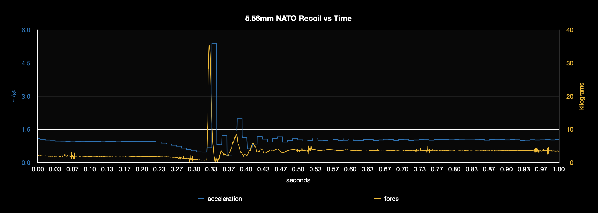
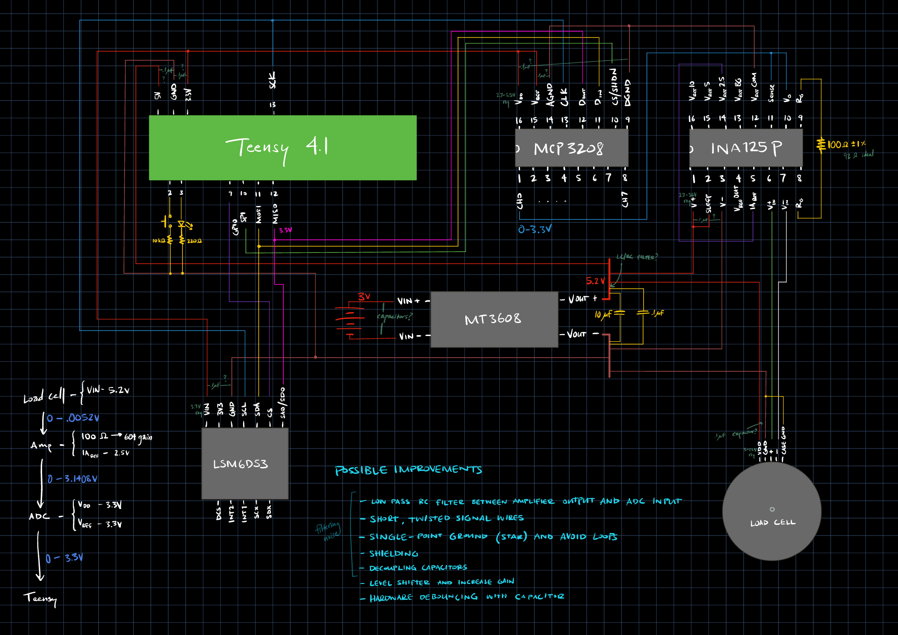

# Recoil Measurement Fixture

This project's purpose is to more fully understand the interplay between the gas block, buffer weight, and buffer spring of AR style weapons as well as how they affect felt recoil and muzzle rise.

This test stand delivers metrics to quantitatively assess rifle recoil and muzzle rise. Any rifle setup may be evaluated (to satisfy curiosity and to tune it with weights, muzzle brakes, etc), but my express intent is to optimize gas-operated firearms. To this point, it has been used to capture recoil on 5.56mm NATO, 6.5mm Creedmoor, and 300 AAC Blackout gas firearms.

<!---->

   

---

## Hardware

  
  

| Component Type              | Part / Model                                           |
|-----------------------------|--------------------------------------------------------|
| Microcontroller             | Teensy 4.1                                             |
| IMU                         | STMicroelectronics LSM6DS3 (on a NOYITO breakout board)|
| Load cell                   | Phidgets 50kg C2 3160_0 button load cell               |
| Amplifier                   | Texas Instruments INA125P                              |
| Analog to digital converter | Microchip Technology MCP3208                           |
| Power                       | CR123A battery and housing                             |
| DC to DC boost converter    | MT3608                                                 |
| Switch                      | SPST switch                                            |
| Button                      | Momentary push button                                  |
| LED                         | T-1 3/4 (standard 5mm)                                 |

Force is measured (load cell), amplified (INA125P), and converted to discrete values (MCP3208). These values along with IMU data (LSM6DS3) are fed to the Teensy 4.1 microcontroller. Communication between the Teensy and the peripherals is done via SPI. The power source used is a single CR123A battery with the voltage stepped up (MT3608) to 5.2V.

   
  <em>Circuit Sketch (current)</em>

Reference the accompanying [circuit diagram](media/circuit_diagram.png) (out of date) and [sketch](media/circuit_sketch.png) (out of date).

Additionally, a custom [printed circuit board](hardware/PCB.kicad_pro) (out of date) has been designed in order for size constraints to be met (originally the rifle was to be mounted in a test stand, but I wanted to make all the electronics fit onboard the rifle). The PCB has since been modified. The [sketch](media/circuit_sketch2.png) and this [board layout image](media/board_layout.png) reflect the changes made.

A sled for the electronics was designed and 3D printed. It slides into a modified B5 SOPMOD stock.

---

## Features and Status

### Current
- Collects force, acceleration, and gyroscope data
- Sample rate: 9000 Hz
- Logs to a .bin file on an SD card (automatic)
- Converts from .bin to .csv (upon button press)

### Planned
- Increased sample rate
- Shot detection
- Data processing:
  - Denoising (low pass filter, Kalman filter, or moving average)
  - Muzzle flip angle measurement (orientation)
  - Recoil distance measurement (velocity and position)
- Upgrade IMU to ICM-40609-D on a Mikroe-6420 breakout board

### Known Limitations
- Ripples are observable (about every 250ms) in the force data. The MT3608 is suspected.
- Output data rate for the IMU is insufficient (6.66kHz for accelerometer, 1.66kHz for gyroscope).
- System voltage is not dynamically measured, which could lead to inaccuracies in reported measurements over time due to battery drain or voltage change from environmental effects on the battery.
- Calibration with a known weight is not performed each time the unit is powered on, which could lead to inaccuracies in reported force measurements with changing environments.
- Clipped acceleration values are probable with large caliber rifles (a high g accelerometer could be added to the system to supplement the LSM6DS3).

---

## Project Info

**Status:** Alpha (early development, but manually tested and working reliably with limited functionality)  
**Author:** T. Stratton  
**Start Date:** 24-DEC-2024  
**License:** Non-Commercial, Personal Use Only – see [LICENSE](./LICENSE)  
**Language:** Arduino  
**Topics:** rifle, recoil, measurement, kinematics